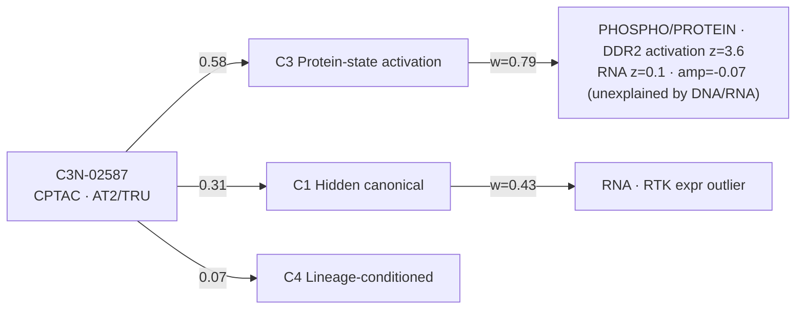
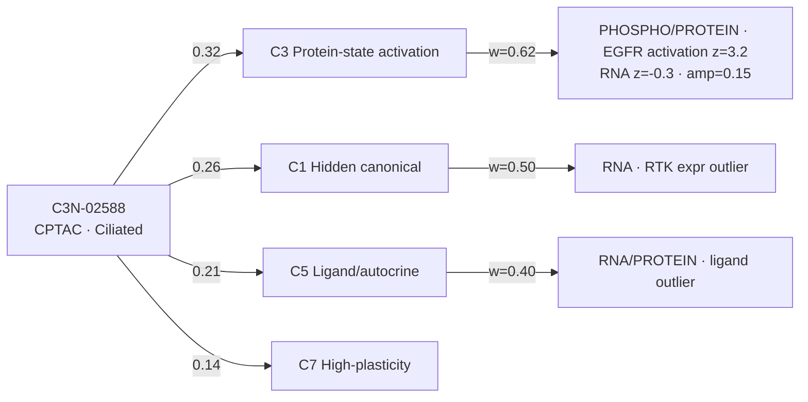
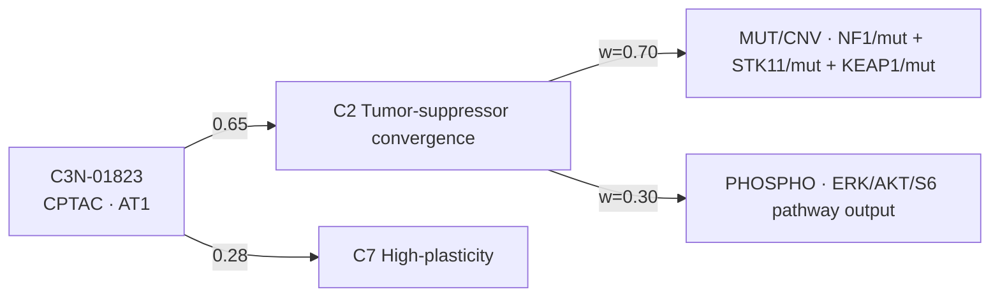
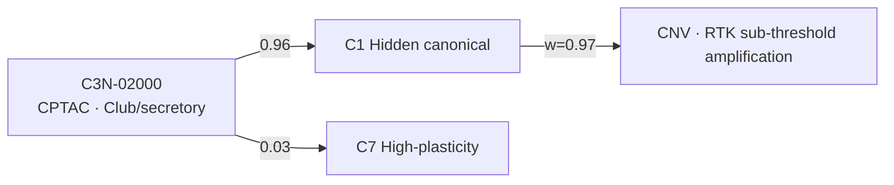
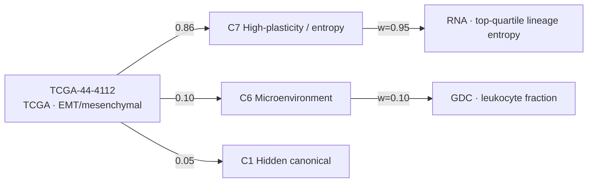

# Deliverable #2 — Per-tumor evidence graphs

Every oncogene-negative tumor (117 TCGA + 22 CPTAC = 139) has an **evidence graph**: the tumor node, the
competing mechanistic classes it could belong to (with posterior mass), and the concrete evidence items
that fed each class (source layer, feature, signed value, weight). This is the auditable backbone of the
taxonomy — no tumor is assigned a class without a visible reason, and every *competing* class is retained
so a reader can see what was almost chosen.

- **Machine-readable, all 139 tumors:** `per_tumor_evidence.json`
  ```
  { "<tumor_id>": {
      "cohort", "best_class", "best_p", "dominant_lineage", "lineage_entropy",
      "posteriors":  { C1..C8 },                       # the full 8-class posterior
      "competing":   [ {class,label,p}, ... ],         # classes with p>0.02, ranked
      "evidence":    [ {class,source,feature,value,weight}, ... ]   # ranked by weight
  } }
  ```
- **Flat evidence items:** `evidence_items_TCGA.csv`, `evidence_items_CPTAC.csv`
- **Posteriors table:** `tumor_evidence_TCGA.csv`, `tumor_evidence_CPTAC.csv`

## How to read an evidence graph

`tumor → {competing classes} → {evidence items}`. Edge to a class = posterior mass. Edge into a class from
an evidence item = that item's weight. A tumor is "well-explained" when one cell-intrinsic class (C1–C5)
carries most of the mass and rests on ≥1 high-weight item; it is "unexplained" when the mass sits on
microenvironment/entropy/unknown (see Deliverable #4).

## Worked examples

### 1. C3N-02587 — protein-state activation via **DDR2** (the cleanest Class-3 case)

An RTK activated purely at the protein/phospho level: DDR2 activation z = 3.6 while its RNA is exactly
average (z = 0.1) and its locus is not amplified. Invisible to any DNA/RNA-only analysis.



### 2. C3N-02588 — protein-state activation via **EGFR with below-average RNA**

EGFR activation z = 3.2 with **RNA z = −0.3** and no amplification — the signature of a stabilized /
recycling-defective / ligand-poised receptor whose activity lives entirely in the proteome. Note the
competition: C1 and C5 also draw mass (an RTK-outlier and a ligand-outlier reading), and the graph keeps
all three so the ambiguity is explicit (best_p = 0.32).



### 3. C3N-01823 — textbook **tumor-suppressor convergence** (C2)

Three suppressors hit at once (NF1 + STK11 + KEAP1), a near-canonical RAS-pathway-by-loss configuration.
High confidence (best_p = 0.65), residual entropy the only competitor.



### 4. C3N-02000 — **hidden canonical** driver (borderline amplification)

A single dominant item: a sub-threshold RTK amplification (below the oncogene-positive cut) carries the
whole call (best_p = 0.96). This is exactly the tumor a deeper genomic look would most likely re-classify
as canonically driven.



### 5. TCGA-44-4112 — **unexplained / high-plasticity** (C7)

No cell-intrinsic lesion of any kind (max C1–C5 = 0.045); the only positive signal is top-quartile
lineage-state entropy in an EMT/mesenchymal tumor. This is a genuine "we have no intrinsic driver
mechanism" tumor — a Deliverable #4 candidate for new sequencing.



## Coverage summary

| | TCGA (n=117) | CPTAC (n=22) |
|---|---|---|
| tumors with ≥1 evidence item | 117 | 22 |
| tumors with a cell-intrinsic explanation ≥0.35 (C1–C5) | 63 (54%) | 10 (45%) |
| tumors whose best call is context/plasticity/unknown (C6–C8) | 54 (46%) | 12 (55%) |

The evidence graphs make the taxonomy falsifiable at the level of the individual tumor: to overturn a
call, point at the item that is wrong.
